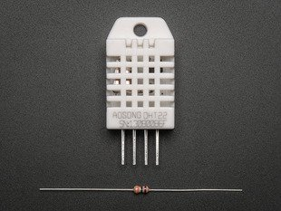
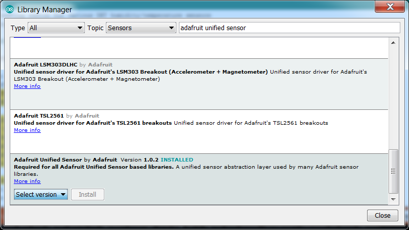
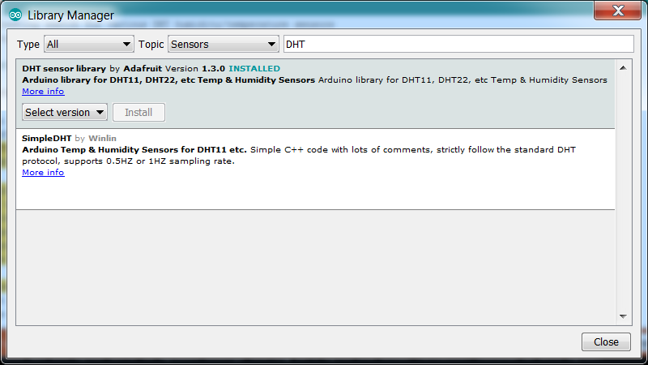
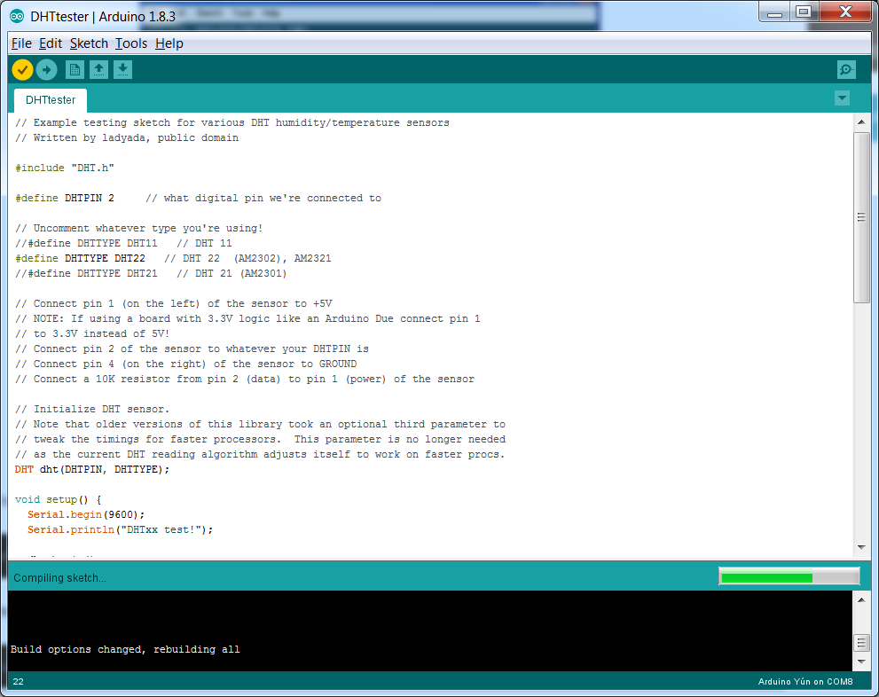
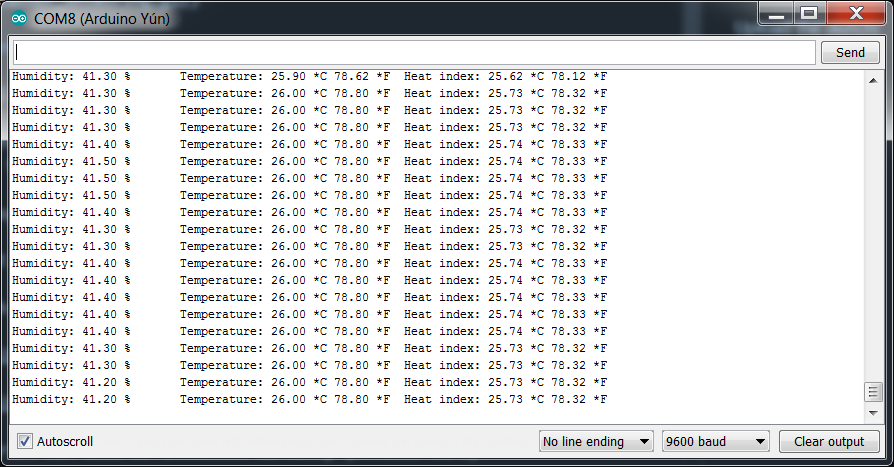

# Overview

This tutorial covers the low cost DHT22 temperature & humidity sensor. 

For more details refer to : https://learn.adafruit.com/dht/

# Wiring

This diagram shows how to connect the testing sketch. 

Connect data to pin 2. This can be changed it later to any pin.

# Libraries

Install 2 additional libraries:

* **Adafruit Unified Sensor** 1.0.2
* **DHT Sensor Library** 1.0.3

An easy way is to use the *Arduino IDE Library Manager*: 

1. Select **Sketch->Include Library->Manage Libraries...**
2. Search for the two libraries and install them.

Libraries can also be installed manually (details [here](https://learn.adafruit.com/dht/using-a-dhtxx-sensor)).

# Sketch file

A default sketch file is provided to test the sensor.

Select **File->Examples->DHT sensor library->DHTtester sketch**

Sample code [here](DHTtester.ino).

**Upload the sketch!**

You should see the temperature and humidity. You can see changes by breathing onto the sensor (like you would to fog up a window) which should increase the humidity.

