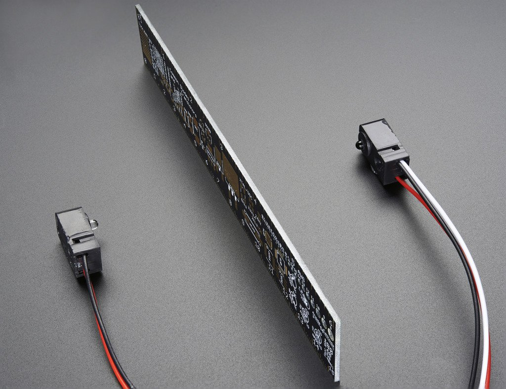
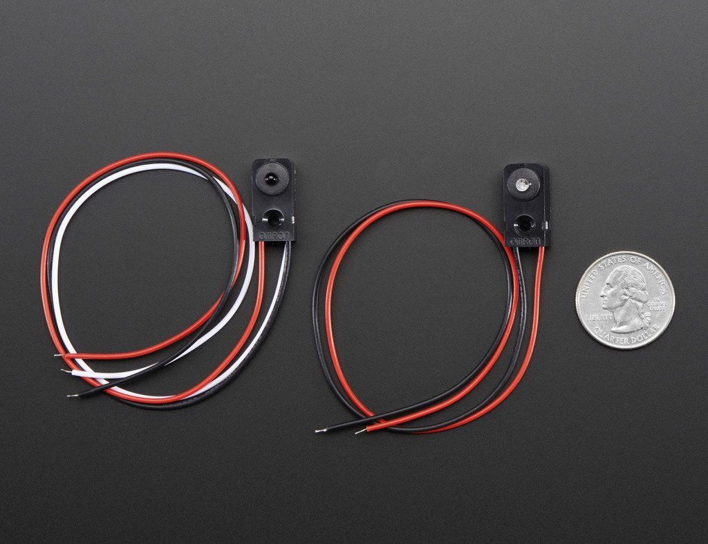
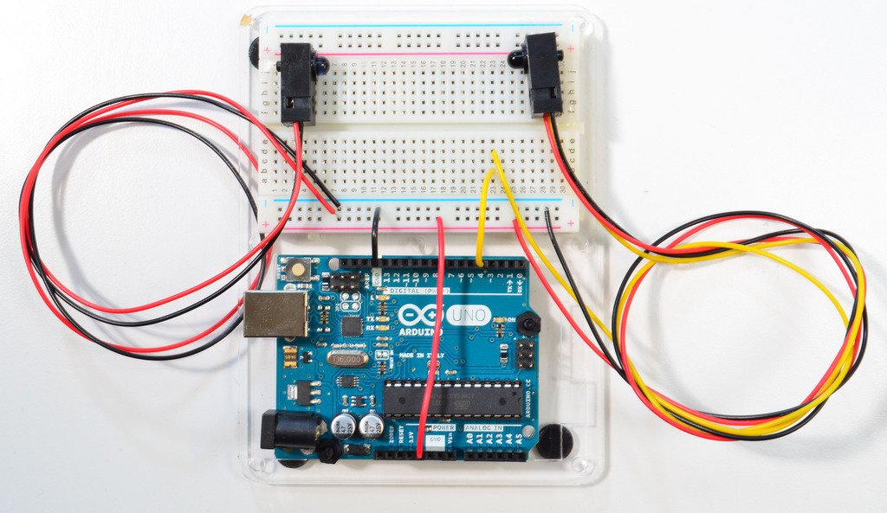
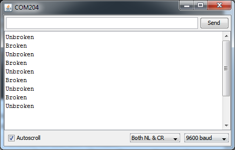

# Overview


Infrared (IR) break-beam sensors are a simple way to detect motion. They work by having an emitter side that sends out a beam of human-invisible IR light, then a receiver across the way which is sensitive to that same light. When something passes between the two, and its not transparent to IR, then the 'beam is broken' and the receiver will let you know.

Compared to PIR sensors, breakbeams are faster and allow better control of where you want to detect the motion. Compared to Sonar modules, they're less expensive. However, you do need **both** emitter and receiver


The receiver is on the left, it has three wires. The transmitter is on the right, it has two wires

# Wiring
Wiring these sensors is really easy.

First up you'll need to power the transmitter. Connect the black wire to ground and the red wire directly to 3.3V or 5V power. It will draw 9mA from 3.3V (lower power) and 20mA from 5V (better range).

Next up you'll want to connect up the receiver. Connect the black wire to ground, the red wire to 3.3V or 5V (whichever logic level you like) and then the white or yellow wire to your digital input.

Note that you do not have to share power supply ground or power between the two, the 'signal' is sent optically.

The receiver is **open collector** which means that you do need a pull up resistor. Most microcontrollers have the ability to turn on a built in pull up resistor. If you do not, connect a 10K resistor between the white wire of the receiver and the red wire.

On an Arduino, we'll connect the signal (yellow/white) pin to Digital #4



Run this demo code on your Arduino

```c
/*
  IR Breakbeam sensor demo!
*/

#define LEDPIN 13
  // Pin 13: Arduino has an LED connected on pin 13
  // Pin 11: Teensy 2.0 has the LED on pin 11
  // Pin  6: Teensy++ 2.0 has the LED on pin 6
  // Pin 13: Teensy 3.0 has the LED on pin 13

#define SENSORPIN 4

// variables will change:
int sensorState = 0, lastState=0;         // variable for reading the pushbutton status

void setup() {
  // initialize the LED pin as an output:
  pinMode(LEDPIN, OUTPUT);      
  // initialize the sensor pin as an input:
  pinMode(SENSORPIN, INPUT);     
  digitalWrite(SENSORPIN, HIGH); // turn on the pullup

  Serial.begin(9600);
}

void loop(){
  // read the state of the pushbutton value:
  sensorState = digitalRead(SENSORPIN);

  // check if the sensor beam is broken
  // if it is, the sensorState is LOW:
  if (sensorState == LOW) {     
    // turn LED on:
    digitalWrite(LEDPIN, HIGH);  
  }
  else {
    // turn LED off:
    digitalWrite(LEDPIN, LOW);
  }

  if (sensorState && !lastState) {
    Serial.println("Unbroken");
  }
  if (!sensorState && lastState) {
    Serial.println("Broken");
  }
  lastState = sensorState;
}
```

With the above wiring, when you put you hand between the sensor pair, the onboard LED will turn on and the serial console will print out messages:


