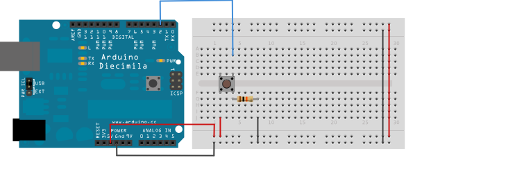

# Button

## Physical setup
You will find [here](https://www.arduino.cc/en/tutorial/button) the tutorial for button.
Here is the scheam for setting up the button on the arduino:

# Sample source code
Here is the [link](./button.ino) to the sample code
