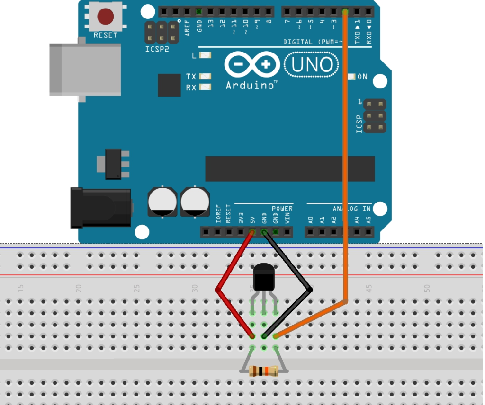

Hall Effect Sensor
==================

- Connect pin 1 for sensor to the Arduino +5V
- Connect pin 2 for sensor to the Arduino GND
- Connect pin 3 for sensor to Arduino digital pin 2
- A pull-up resistor is required between pin 1 and pin 3

When a magnet touch the sensor, the integrated led turns on.

