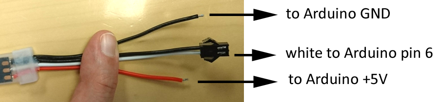

NeoPixel LED strip
==================

- Connect the black wire to the Arduino GND
- Connect the red wire to the Arduino +5V
- Connect the white wire frome the connector to the Arduino pin 6

Download the [sketch](./neoPixel_led_strip.ino).
If the LEDs doesn't light up, unplug the Arduino USB from the computer and reconnect it and wait (do not re-download the sketch)

https://learn.adafruit.com/neopixel-painter/test-neopixel-strip
