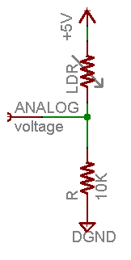

Using a photocell resistor
==========================

You can follow the [Adafruit Photocell guide](https://learn.adafruit.com/photocells/using-a-photocell)

Example schema taken from the previous tutorial:

