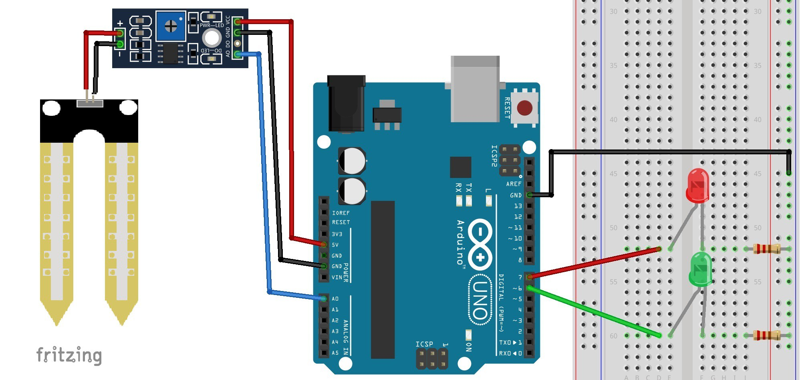

# Soil Moisture Sensor

Source: https://randomnerdtutorials.com/guide-for-soil-moisture-sensor-yl-69-or-hl-69-with-the-arduino/

## Schematics

To complete the project, follow these schematics:

## Upload the code

[soil_moisture_sensor.ino](./soil_moisture_sensor.ino)

