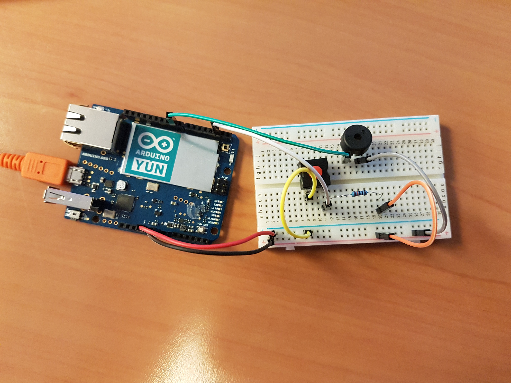

# IoT Use case: alarm 

## Physical setup
This is a simple combination of a button and a piezo buzzer.
Here is the scheam for setting up the button on the arduino:

# Sample source code
Here is the [link](./alarm.ino) to the sample code.
Prior uploading it to the arduino, you shoùld have the sparkgw running with also the ngrok software in order to replace xxxxx in the sample code to the right id return by ngork
